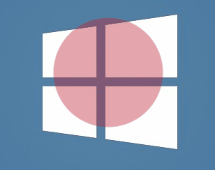

# tune into your breath
a simple app to help you to practice mindful breathing

### to install modules
`npm i`

### to start electron app
`npm run start`

### how to use
hit `esc` while the app is active to open config panel

